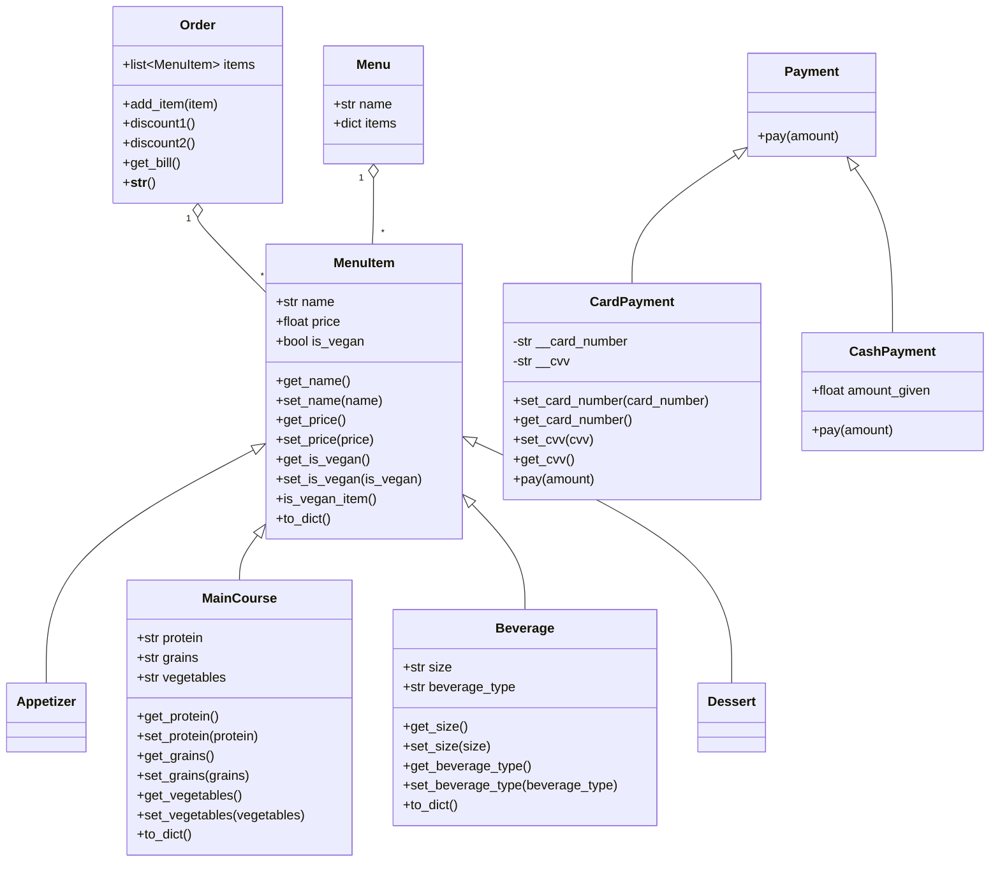

# RETO_7
Restaurant revisited

## Diagrama de clases:

```mermaid
classDiagram
    class MenuItem {
        +str name
        +float price
        +bool is_vegan
        +get_name()
        +set_name(name)
        +get_price()
        +set_price(price)
        +get_is_vegan()
        +set_is_vegan(is_vegan)
        +is_vegan_item()
        +to_dict()
    }
    class Appetizer
    class MainCourse {
        +str protein
        +str grains
        +str vegetables
        +get_protein()
        +set_protein(protein)
        +get_grains()
        +set_grains(grains)
        +get_vegetables()
        +set_vegetables(vegetables)
        +to_dict()
    }
    class Beverage {
        +str size
        +str beverage_type
        +get_size()
        +set_size(size)
        +get_beverage_type()
        +set_beverage_type(beverage_type)
        +to_dict()
    }
    class Dessert

    MenuItem <|-- Appetizer
    MenuItem <|-- MainCourse
    MenuItem <|-- Beverage
    MenuItem <|-- Dessert

    class Menu {
        +str name
        +dict items
    }

    class Order {
        +list~MenuItem~ items
        +add_item(item)
        +discount1()
        +discount2()
        +get_bill()
        +__str__()
    }
    class Payment {
        +pay(amount)
    }
    class CardPayment {
        -str __card_number
        -str __cvv
        +set_card_number(card_number)
        +get_card_number()
        +set_cvv(cvv)
        +get_cvv()
        +pay(amount)
    }
    class CashPayment {
        +float amount_given
        +pay(amount)
    }

    Payment <|-- CardPayment
    Payment <|-- CashPayment

    Order "1" o-- "*" MenuItem
    Menu "1" o-- "*" MenuItem
```
Este fue un reto MUY desafiante.
